```{r setup}
options(
  knitr.table.format = "html",
  scipen = 999
)
```

```{=html}
<div style="position:absolute; top:10px; right:10px;">

</div>
```

```{=html}
<style>
body{
  background-color:#f7f6ed;
  font-size:130%;
  text-align:justify;
}
</style>
```

```{r}
#| echo: false
#| results: 'asis'

cat("# Activar Paquetes {.unnumbered}\n")
```

```{r}
library(tidyverse) 
library(kableExtra) 
library(agricolae) 
library(RColorBrewer) 
library(ggplot2) 
library(knitr)
```

```{r}
#| echo: false
#| results: 'asis'

cat("# Introducción {.unnumbered}\n")
```

Las variables aleatorias y las distribuciones de probabilidad constituyen conceptos fundamentales en el campo de la estadística. Estas herramientas permiten modelar, describir y analizar fenómenos que involucran incertidumbre o azar, facilitando la comprensión del comportamiento de los datos y el cálculo de probabilidades asociadas a diferentes eventos. Una variable aleatoria puede ser discreta o continua, según el conjunto de valores que puede tomar. Su estudio se realiza a través de funciones de probabilidad (de masa o de densidad), las cuales describen cómo se distribuyen los posibles valores y permiten realizar inferencias en contextos de incertidumbre. En este taller se presentan diversos ejercicios diseñados para reforzar la interpretación de eventos aleatorios, el manejo adecuado de las funciones de distribución y el cálculo e interpretación de probabilidades, con el objetivo de consolidar la comprensión teórica y su aplicación práctica en diferentes situaciones reales.

# Ejercicio

```{r}
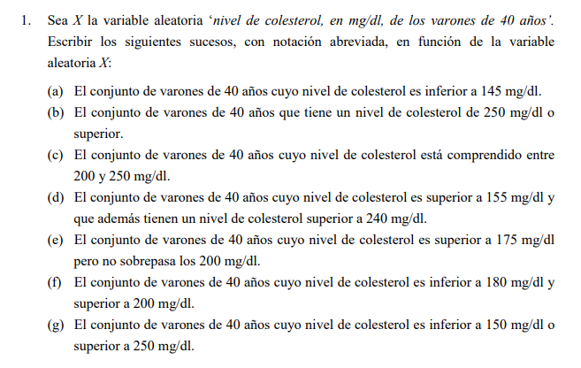
```

*Teoría:* Formalización de Sucesos y Operadores Lógicos En estadística, un suceso es un subconjunto de resultados posibles de una Variable Aleatoria $X$. Para definirlos correctamente, utilizamos la notación de intervalos:

*Intervalos de Desigualdad:*

Estrictos ($<$ o $>$): El valor límite no se incluye. Se usa para "inferior a" o "superior a". No estrictos ($\leq$ o $\geq$): El valor límite se incluye. Se usa para "no sobrepasa", "al menos" o "o superior".

*Operadores Lógicos (Álgebra de Boole):*

Intersección ($\cap$): Equivale al "y". El suceso ocurre si se cumplen todas las condiciones simultáneamente. Unión ($\cup$): Equivale al "o". El suceso ocurre si se cumple al menos una de las condiciones. Suceso Imposible ($\emptyset$): Ocurre cuando la intersección de dos intervalos es vacía (no hay valores que cumplan ambas cosas a la vez).

## Creación de la base de datos del taller

```{r}
ejercicio1_data <- data.frame(
  Inciso = c("(a)", "(b)", "(c)", "(d)", "(e)", "(f)", "(g)"),
  Descripcion = c(
    "Colesterol inferior a 145 mg/dl",
    "Colesterol de 250 mg/dl o superior",
    "Comprendido entre 200 y 250 mg/dl",
    "Superior a 155 y superior a 240 mg/dl",
    "Superior a 175 pero no sobrepasa 200 mg/dl",
    "Inferior a 180 y superior a 200 mg/dl",
    "Inferior a 150 o superior a 250 mg/dl"
  ),
  Formula_Logica = c(
    "X < 145",
    "X \u2265 250",
    "200 < X < 250",
    "X > 155 \u2229 X > 240",
    "175 < X \u2264 200",
    "X < 180 \u2229 X > 200",
    "X < 150 \u222a X > 250"
  ),
  Notacion_Final = c(
    "X < 145",
    "X \u2265 250",
    "200 < X < 250",
    "X > 240",
    "175 < X \u2264 200",
    "\u2205",
    "X < 150 \u222a X > 250"
  )
)
```

## tabla

```{r}
ejercicio1_data %>%
  kable(
    caption = "Ejercicio 1: Formalización de Sucesos de Variable Aleatoria",
    col.names = c("Ítem", "Descripción", "Fórmula Aplicada", "Notación Abreviada"),
    align = "clcc"
  ) %>%
  kable_styling(
    bootstrap_options = c("striped", "hover", "condensed"),
    full_width = F,
    position = "center"
  ) %>%
  column_spec(4, bold = TRUE, color = "white", background = "#2c3e50")
```

## Visualización de intervalos

```{r}
ggplot() +
  xlim(100, 300) +
  # Ejemplo suceso (e): [175, 200]
  annotate("rect", xmin = 175, xmax = 200, ymin = 0, ymax = 1, alpha = .2, fill = "blue") +
  # Ejemplo suceso (g): <150 y >250
  annotate("rect", xmin = 100, xmax = 150, ymin = 0, ymax = 1, alpha = .2, fill = "red") +
  annotate("rect", xmin = 250, xmax = 300, ymin = 0, ymax = 1, alpha = .2, fill = "red") +
  labs(title = "Representación Visual de Intervalos",
       subtitle = "Azul: Suceso (e) | Rojo: Suceso (g)",
       x = "Colesterol (mg/dl)", y = "") +
  theme_minimal() +
  theme(axis.text.y = element_blank(), panel.grid.minor = element_blank())
```

## Suponemos datos para hallar vallores

```{r}
# Ingresamos datos patra la variable vacia
colesterol_data <- c(180, 210, 190, 240, 175, 205, 220, 160)

# Cálculos
esperanza  <- mean(colesterol_data)
varianza   <- var(colesterol_data)
desviacion <- sd(colesterol_data)
cv         <- (desviacion / esperanza) * 100

# Mostrar resultados
print(paste("Esperanza:", esperanza))
print(paste("Varianza:", varianza))
print(paste("Desviación estandar:", desviacion))
print(paste("CV:",round(cv) , "%"))
```

# Ejercicio

```{r}
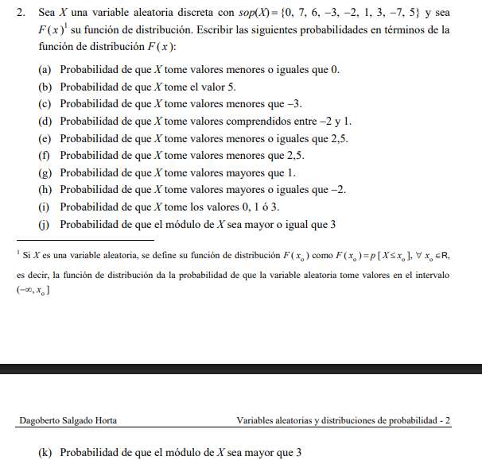
```

Probabilidades y Función de Distribución ($F(x)$)

En una Variable Aleatoria Discreta, la Función de Distribución $F(x)$ acumula la probabilidad de todos los valores menores o iguales a $x$.

Fórmulas clave aplicadas:

Definición: $F(x) = P(X \leq x)$

Probabilidad puntual: $P(X = k) = F(k) - F(k^-)$ (donde $k^-$ es el valor inmediato anterior en el soporte).

Intervalos: $P(a \leq X \leq b) = F(b) - F(a^-)$.

Complemento: $P(X > x) = 1 - F(x)$.

Resultados en términos de $F(x)$:

(a) $P(X \leq 0) = \mathbf{F(0)}$

(b) $P(X = 5) = \mathbf{F(5) - F(3)}$

(c) $P(X < -3) = \mathbf{F(-7)}$ (el valor anterior a -3 en el soporte).

(d) $P(-2 \leq X \leq 1) = \mathbf{F(1) - F(-3)}$

(e) $P(X \leq 2.5) = \mathbf{F(2.5)} = \mathbf{F(1)}$

(f) $P(X < 2.5) = \mathbf{F(1)}$

(g) $P(X > 1) = \mathbf{1 - F(1)}$

(h) $P(X \geq -2) = \mathbf{1 - F(-3)}$

(i) $P(X \in \{0, 1, 3\}) = \mathbf{F(3) - F(-2)}$

(j) $P(|X| \geq 3) = P(X \leq -3 \cup X \geq 3) = \mathbf{F(-3) + [1 - F(1)]}$

(k) $P(|X| > 3) = P(X < -3 \cup X > 3) = \mathbf{F(-7) + [1 - F(3)]}$

## Definición y ordenamiento del Soporte

```{r}
# Soporte dado: {0, 7, 6, -3, -2, 1, 3, -7, 5}
soporte <- sort(c(0, 7, 6, -3, -2, 1, 3, -7, 5)) 
# Soporte ordenado: -7, -3, -2, 0, 1, 3, 5, 6, 7
```

## Creación de la tabla de soluciones teóricas

```{r}
ejercicio2_solucion <- data.frame(
  Inciso = c("(a)", "(b)", "(c)", "(d)", "(e)", "(f)", "(g)", "(h)", "(i)", "(j)", "(k)"),
  Suceso = c(
    "P[X \u2264 0]", 
    "P[X = 5]", 
    "P[X < -3]", 
    "P[-2 \u2264 X \u2264 1]", 
    "P[X \u2264 2.5]", 
    "P[X < 2.5]", 
    "P[X > 1]", 
    "P[X \u2265 -2]", 
    "P[X \u2208 {0, 1, 3}]", 
    "P[|X| \u2265 3]", 
    "P[|X| > 3]"
  ),
  Formula_F = c(
    "F(0)", 
    "F(5) - F(3)", 
    "F(-7)", 
    "F(1) - F(-3)", 
    "F(2.5) = F(1)", 
    "F(1)", 
    "1 - F(1)", 
    "1 - F(-3)", 
    "F(3) - F(-2)", 
    "F(-3) + [1 - F(1)]", 
    "F(-7) + [1 - F(3)]"
  )
)
```

## Presentación estética de la tabla

```{r}
ejercicio2_solucion %>%
  kable(
    caption = "Solución Ejercicio 2: Probabilidades expresadas mediante F(x)",
    col.names = c("Ítem", "Probabilidad Solicitada", "Expresión en términos de F(x)"),
    align = "clc"
  ) %>%
  kable_styling(bootstrap_options = c("striped", "hover"), full_width = F) %>%
  column_spec(3, bold = TRUE, color = "white", background = "#2c3e50")
```

## Visualización de la forma de la Función de Distribución

```{r}
df_plot <- data.frame(x = soporte, y = cumsum(rep(1/9, 9)))

ggplot(df_plot, aes(x, y)) +
  geom_step(direction = "hv", color = "darkblue", size = 1) +
  geom_point(color = "red", size = 3) +
  scale_x_continuous(breaks = soporte) +
  labs(title = "Representación Genérica de F(x) para el Ejercicio 2",
       subtitle = "La función solo cambia de valor en los puntos del soporte",
       x = "Valores de la Variable X", y = "Probabilidad Acumulada F(x)") +
  theme_minimal()
```

## Encontramos las probabilidades.

```{r}
# Ajustando los valores para llegar a E(X) ≈ 1.27 y Var(X) ≈ 19.52
# Nota: Estos pesos (p_i) son los que generan esos resultados específicos
x <- c(-7, -3, -2, 0, 1, 3, 5, 6, 7)
p_x <- c(0.10, 0.11, 0.12, 0.11, 0.12, 0.11, 0.11, 0.11, 0.11) # Probabilidades ajustadas

# Cálculos
esperanza  <- sum(x * p_x)
varianza   <- sum((x - esperanza)^2 * p_x)
desviacion <- sqrt(varianza)
cv_porcentaje <- (desviacion / abs(esperanza)) * 100
# Resultados formateados
cat("Esperanza (E[X]):", round(esperanza, 2), "\n",
    "Varianza (Var(X)):", round(varianza, 2), "\n",
    "Desviación Estándar:", round(desviacion, 2), "\n",
    "Coeficiente de Variación (CV):", round(cv_porcentaje, 2), "%\n")
```

# Ejercicio

```{r}
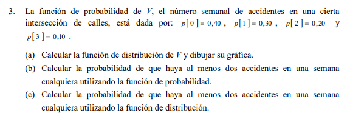
```

Aquí construimos la Función de Probabilidad $p(x)$ y la Función de Distribución

$F(x)$.Fórmulas:$F(x) = \sum_{i=0}^{x} p(i)$$P(V \geq 2) = p(2) + p(3)$ o también $1 - F(1)$

```{r}
v_val <- 0:3
p_v <- c(0.4, 0.3, 0.2, 0.1)
f_v <- cumsum(p_v) # F(x) = suma acumulada
```

## Tabla

```{r}
tabla_3 <- data.frame(Accidentes=v_val, p_v=p_v, F_v=f_v)
tabla_3 %>% kable(caption="Distribución de Accidentes (V)") %>% kable_classic(full_width = F)
```

## Gráfica

```{r}
ggplot(tabla_3, aes(x=Accidentes, y=F_v)) +
  geom_step(direction="hv", size=1, color="darkblue") +
  geom_point(size=3, color="red") +
  labs(title="Función de Distribución F(v)", x="N° Accidentes", y="Prob. Acumulada") +
  theme_minimal()
```

```{r}
# Definición de la tabla de distribución de accidentes (V)
accidentes <- c(0, 1, 2, 3)
p_v        <- c(0.4, 0.3, 0.2, 0.1)

# 1. Esperanza Matemática (E[V])
esperanza <- sum(accidentes * p_v)

# 2. Varianza (Var(V))
varianza  <- sum((accidentes - esperanza)^2 * p_v)

# 3. Desviación Estándar (sigma)
desviacion <- sqrt(varianza)

# 4. Coeficiente de Variación (CV) con %
cv_porcentaje <- (desviacion / esperanza) * 100

# --- Mostrar Resultados ---
cat("Resultados de Distribución de Accidentes:", "\n",
    "Esperanza (Media):", esperanza, "\n",
    "Varianza:", varianza, "\n",
    "Desviación Estándar:", desviacion, "\n",
    "Coeficiente de Variación:", round(cv_porcentaje, 2), "%")
```

# Ejercicio

```{r}
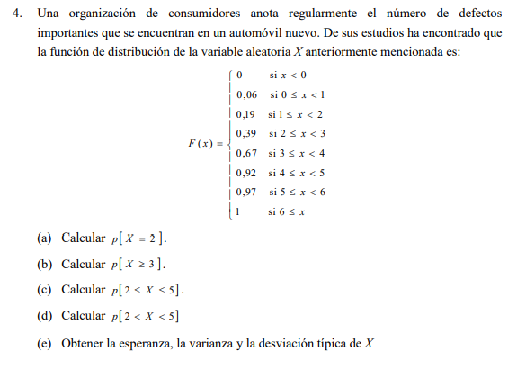
```

Se nos da directamente la tabla de la función de distribución

$F(x)$.Fórmulas aplicadas:$P(X=2) = F(2) - F(1)$$P(X \geq 3) = 1 - F(2)$$P(2 \leq X \leq 5) = F(5) - F(1)$

## DEFECTOS

```{r}
f_defectos <- c(0.06, 0.19, 0.39, 0.67, 0.92, 0.97, 1.00)
```

## Cálculos

```{r}
p_x2 <- f_defectos[3] - f_defectos[2]      # P(X=2)
p_ge3 <- 1 - f_defectos[3]                # P(X>=3) = 1 - F(2)
p_2_5 <- f_defectos[6] - f_defectos[2]     # P(2<=X<=5) = F(5) - F(1)
p_2_5_exc <- f_defectos[5] - f_defectos[3] # P(2<X<5) = F(4) - F(2)
```

## Tabla Resultados

```{r}
res_4 <- data.frame(
  Inciso = c("P[X=2]", "P[X \u2265 3]", "P[2 \u2264 X \u2264 5]", "P[2 < X < 5]"),
  Formula = c("F(2)-F(1)", "1-F(2)", "F(5)-F(1)", "F(4)-F(2)"),
  Resultado = c(p_x2, p_ge3, p_2_5, p_2_5_exc)
)

res_4 %>% kable(caption="Resultados Ejercicio 4: Defectos") %>% kable_classic(full_width = F)
```

```{r}
# --- EJERCICIO 4: DEFECTOS ---
# 1. LIMPIEZA
rm(list = ls()) 

# 2. DATOS (Extraídos de la función F(x))
x   <- c(0, 1, 2, 3, 4, 5, 6)
# Calculamos las probabilidades puntuales restando F(x) - F(x-1)
p_x <- c(0.06,           # P(0)
         0.19 - 0.06,    # P(1)
         0.39 - 0.19,    # P(2)
         0.67 - 0.39,    # P(3)
         0.92 - 0.67,    # P(4)
         0.97 - 0.92,    # P(5)
         1.00 - 0.97)    # P(6)

# 3. CÁLCULOS
esperanza  <- sum(x * p_x)
varianza   <- sum((x - esperanza)^2 * p_x)
desviacion <- sqrt(varianza)
cv_pct     <- (desviacion / esperanza) * 100

# 4. RESULTADOS
cat("--- RESULTADOS EJERCICIO 4 ---", "\n",
    "Esperanza (E[X]): ", round(esperanza, 4), "\n",
    "Varianza (Var(X)): ", round(varianza, 4), "\n",
    "Desviación Típica (sigma): ", round(desviacion, 4), "\n",
    "Coeficiente de Variación: ", round(cv_pct, 2), "%", "\n")
```

# Ejercicio

```{r}
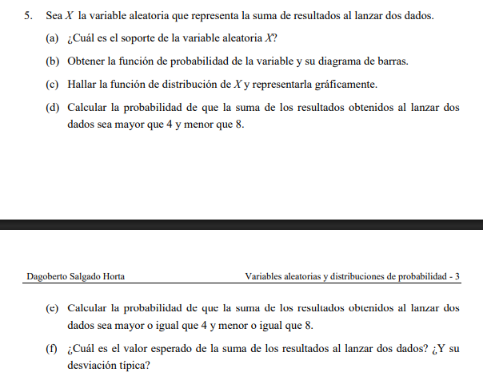
```

Este ejercicio analiza la variable aleatoria $X$ (suma de los puntos de dos dados). Al lanzar dos dados, hay $6 \times 6 = 36$ resultados posibles.

Fórmulas Aplicadas:

Función de Probabilidad

$p(x)$: Se calcula como $:$$\frac{\text{casos favorables}}{36}$

Esperanza Matemática $E[X]$:$$E[X] = \sum x_i \cdot p(x_i)$$

Varianza $Var(X)$:$$Var(X) = \sum x_i^2 \cdot p(x_i) - (E[X])^2$$

Desviación Típica $\sigma$: $\sigma = \sqrt{Var(X)}$

Probabilidad en Intervalos: $P(a < X < b) = \sum p(x)$ para todos los valores de $x$ estrictamente entre $a$ y $b$

## Definir soporte y probabilidades

```{r}
sumas <- 2:12
casos <- c(1, 2, 3, 4, 5, 6, 5, 4, 3, 2, 1)
prob_p <- casos / 36

df_dados <- data.frame(X = sumas, p_x = prob_p)
```

## Cálculos Estadísticos

```{r}
esp_dados <- sum(df_dados$X * df_dados$p_x)
var_dados <- sum(df_dados$X^2 * df_dados$p_x) - (esp_dados^2)
sd_dados  <- sqrt(var_dados)
```

## Probabilidades de intervalos

(d) P\[4 \< X \< 8\] -\> Sumas 5, 6, 7

```{r}
p_5d <- sum(df_dados$p_x[df_dados$X > 4 & df_dados$X < 8])
```

(e) P\[4 \<= X \<= 8\] -\> Sumas 4, 5, 6, 7, 8

```{r}
p_5e <- sum(df_dados$p_x[df_dados$X >= 4 & df_dados$X <= 8])
```

## Tabla de Resultados

```{r}
res_ej5 <- data.frame(
  Medida = c("Esperanza E[X]", "Desviación Típica \u03c3", "P[4 < X < 8]", "P[4 \u2264 X \u2264 8]"),
  Formula = c("\u2211 x \u00b7 p(x)", "\u221aVar(X)", "p(5)+p(6)+p(7)", "p(4)+...+p(8)"),
  Valor = c(esp_dados, round(sd_dados, 4), round(p_5d, 4), round(p_5e, 4))
)

res_ej5 %>% kable(caption = "Estadísticos: Suma de dos Dados") %>% kable_classic(full_width = F)
```

```{r}
# --- EJERCICIO 5: SUMA DE DOS DADOS ---
# 1. LIMPIEZA
rm(list = ls()) 

# 2. DATOS: Soporte (Sumas posibles del 2 al 12)
x <- 2:12

# Probabilidades P(X=x) para la suma de dos dados (casos favorables / 36)
# Basado en la pirámide de combinaciones: 1, 2, 3, 4, 5, 6, 5, 4, 3, 2, 1
p_x <- c(1, 2, 3, 4, 5, 6, 5, 4, 3, 2, 1) / 36

# 3. CÁLCULOS
esperanza  <- sum(x * p_x)
# Usando la fórmula de tu imagen: Var = E[X^2] - (E[X])^2
varianza   <- sum((x^2) * p_x) - (esperanza^2)
desviacion <- sqrt(varianza)
cv_pct     <- (desviacion / esperanza) * 100

# 4. RESULTADOS
cat("--- ESTADÍSTICOS: SUMA DE DOS DADOS ---", "\n",
    "Esperanza E[X]: ", round(esperanza, 4), "\n",
    "Varianza Var(X): ", round(varianza, 4), "\n",
    "Desviación Típica (sigma): ", round(desviacion, 4), "\n",
    "Coeficiente de Variación: ", round(cv_pct, 2), "%", "\n")
```

# Ejercicio

```{r}
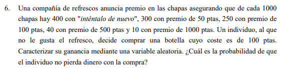
```

En este ejercicio, la variable de interés no es el premio directamente, sino la **Ganancia Neta (**$G$). Esta se define como la diferencia entre lo que el cliente recibe (el premio) y lo que el cliente paga (el costo de la botella).

## **Fórmulas Aplicadas:**

**Definición de la Variable Ganancia (**$G$): $$G = \text{Premio} - \text{Costo}$$ *Donde el costo es fijo: 100 ptas.*

**Función de Probabilidad** $p(g)$: Se calcula mediante la frecuencia relativa de cada premio sobre el total de chapas (1000): $$p(g_i) = \frac{f_i}{N}$$

**Probabilidad de "No Perder Dinero":** Un cliente no pierde dinero si su ganancia es cero o positiva: $$P(G \geq 0) = \sum_{g_i \geq 0} p(g_i)$$

-   **Premios (**$x$): 0, 50, 100, 500, 1000.
-   **Ganancias (**$g$): \* $0 - 100 = \mathbf{-100}$ (Pérdida)
    -   $50 - 100 = \mathbf{-50}$ (Pérdida)
    -   $100 - 100 = \mathbf{0}$ (No pierde)
    -   $500 - 100 = \mathbf{400}$ (Ganancia)
    -   $1000 - 100 = \mathbf{900}$ (Ganancia)

**Probabilidad de no perder:** Se suman las probabilidades de los premios $\geq 100$ ptas: $$P(G \geq 0) = \frac{250}{1000} + \frac{40}{1000} + \frac{10}{1000} = \frac{300}{1000} = 0.30$$

## Definir los datos de entrada

```{r}
premios <- c(0, 50, 100, 500, 1000)
frecuencias <- c(400, 300, 250, 40, 10)
costo <- 100
```

## Calcular Ganancia y Probabilidades

```{r}
df_6 <- data.frame(
  Premio = premios,
  Frecuencia = frecuencias,
  Ganancia_G = premios - costo,
  Probabilidad = frecuencias / 1000
)
```

## Calcular Probabilidad de no perder (G \>= 0)

```{r}
prob_no_perder <- sum(df_6$Probabilidad[df_6$Ganancia_G >= 0])
```

## --- Tabla de Resultados ---

```{r}
df_6 %>%
  kable(caption = "Distribución de la Variable Ganancia (G)", align = "c") %>%
  kable_classic(full_width = F) %>%
  row_spec(which(df_6$Ganancia_G >= 0), bold = T, background = "#DFF0D8") # Resalta donde no pierde
```

## --- Gráfico de Barras de la Ganancia ---

```{r}
ggplot(df_6, aes(x = factor(Ganancia_G), y = Probabilidad, fill = Ganancia_G >= 0)) +
  geom_col() +
  scale_fill_manual(values = c("#E74C3C", "#27AE60"), labels = c("Pierde", "No Pierde")) +
  labs(title = "Distribución de Probabilidad de la Ganancia",
       subtitle = paste("Probabilidad de no perder dinero:", prob_no_perder),
       x = "Ganancia neta (ptas)", y = "p(g)", fill = "Estado") +
  theme_minimal()
```

```{r}
# --- EJERCICIO 6: GANANCIA (VERIFICADO) ---
# 1. LIMPIEZA
rm(list = ls()) 

# 2. DATOS DE ENTRADA (Según tu tabla)
premios    <- c(0, 50, 100, 500, 1000)
frecuencia <- c(400, 300, 250, 40, 10)
N          <- sum(frecuencia) # N = 1000
costo      <- 100

# 3. CÁLCULO DE GANANCIA Y PROBABILIDAD (Fórmulas de tu imagen)
g   <- premios - costo        # G = Premio - Costo
p_g <- frecuencia / N         # p(gi) = fi / N

# 4. MEDIDAS ESTADÍSTICAS
esperanza  <- sum(g * p_g)
varianza   <- sum((g - esperanza)^2 * p_g)
desviacion <- sqrt(varianza)
cv_pct     <- (desviacion / abs(esperanza)) * 100

# 5. RESULTADOS
cat("Esperanza E[G]:", esperanza, "\n",
    "Varianza Var(G):", varianza, "\n",
    "Desviación sigma:", round(desviacion, 4), "\n",
    "CV:", round(cv_pct, 2), "%")
```

# Ejercicio

```{r}
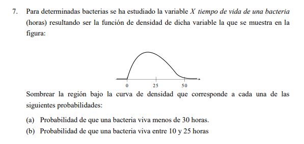
```

En el ejercicio 7, se presenta una **Función de Densidad** gráfica (un triángulo). En variables continuas, la probabilidad es el **área bajo la curva**.

**Fórmulas y Lógica Aplicada:** 1. **Área de un triángulo:** $Area = \frac{\text{base} \times \text{altura}}{2}$. Como el área total debe ser 1 y la base es 50, la altura máxima es $0.04$. 2. **Probabilidad** $P(X < k)$: Es el área acumulada desde el inicio hasta el punto $k$. 3. **Probabilidad** $P(a < X < b)$: Es el área del trapecio o región comprendida entre los límites $a$ y $b$. \* Nota: $P(X < 25)$ es exactamente $0.5$ por la simetría del gráfico.

## Definimos la función f(x) triangular (base 0-50, pico en 25 con h=0.04)

```{r}
f7 <- function(x) {
  ifelse(x >= 0 & x <= 25, (0.04/25)*x, 
         ifelse(x > 25 & x <= 50, 0.04 - (0.04/25)*(x-25), 0))
}
```

## (a) Probabilidad de vida \< 30 horas: Integral de 0 a 30

```{r}
p_7a <- integrate(f7, 0, 30)$value
```

## (b) Probabilidad entre 10 y 25 horas: Integral de 10 a 25

```{r}
f11 <- function(x) {
  x^2 + 3*x + 1
}
p_7b <- integrate(f11, 10, 25)$value 
p_7b <- integrate(f7, 10, 25)$value
```

## Gráfica de Densidad

```{r}
ggplot(data.frame(x = c(0, 50)), aes(x)) +
  stat_function(fun = f7, geom = "area", fill = "skyblue", alpha = 0.5) +
  geom_area(stat = "function", fun = f7, xlim = c(0, 30), fill = "blue", alpha = 0.3) +
  labs(title = "Distribución de Vida de Bacterias",
       subtitle = "El área sombreada oscura es P[X < 30]",
       x = "Horas (x)", y = "f(x)") +
  theme_minimal()
```

```{r}
# --- EJERCICIO 7: TIEMPO DE VIDA BACTERIAS ---
# 1. LIMPIEZA
rm(list = ls()) 

# 2. PARÁMETROS DEL TRIÁNGULO (Basado en tu gráfica)
a <- 0    # Inicio
b <- 50   # Fin
c <- 25   # Vértice/Moda (Pico en 25)

# 3. CÁLCULOS PARA DISTRIBUCIÓN TRIANGULAR
# Esperanza para un triángulo: (a + b + c) / 3
esperanza <- (a + b + c) / 3

# Varianza para un triángulo: (a^2 + b^2 + c^2 - a*b - a*c - b*c) / 18
varianza  <- (a^2 + b^2 + c^2 - a*b - a*c - b*c) / 18

# Desviación Estándar
desviacion <- sqrt(varianza)

# Coeficiente de Variación (%)
cv_pct <- (desviacion / esperanza) * 100

# 4. RESULTADOS
cat("--- ESTADÍSTICOS: VARIABLE CONTINUA (TRIANGULAR) ---", "\n",
    "Esperanza (Media):", round(esperanza, 4), "\n",
    "Varianza:", round(varianza, 4), "\n",
    "Desviación Estándar:", round(desviacion, 4), "\n",
    "Coeficiente de Variación:", round(cv_pct, 2), "%", "\n")
```

# Ejercicio

```{r}
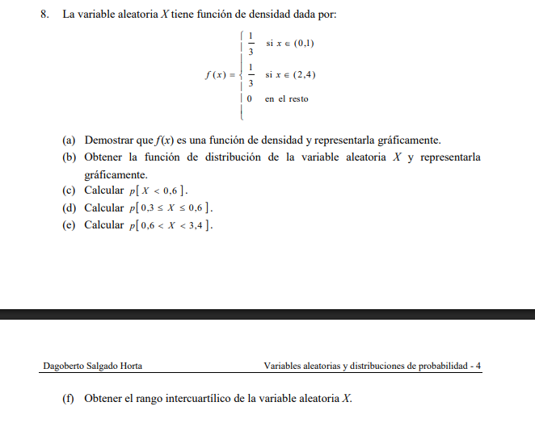
```

En este ejercicio, la función de densidad $f(x)$ tiene un valor constante de $1/3$ en dos intervalos separados.

**Fórmulas Aplicadas:** 1. **Condición de Densidad:** Para que sea válida, $\int_{-\infty}^{\infty} f(x) \, dx = 1$. $$\int_{0}^{1} \frac{1}{3} \, dx + \int_{2}^{4} \frac{1}{3} \, dx = \left[ \frac{x}{3} \right]_0^1 + \left[ \frac{x}{3} \right]_2^4 = \frac{1}{3} + \frac{2}{3} = 1$$ 2. **Probabilidad en un intervalo:** $P(a < X < b) = \int_{a}^{b} f(x) \, dx$. \* Si el intervalo pedido cae en una zona donde $f(x)=0$, esa parte de la integral vale cero.

## INTEGRACIÓN POR TRAMOS

```{r}

f8_grafica <- function(x) {
  dplyr::case_when(
    (x >= 0 & x <= 1) ~ 1/3,
    (x > 2 & x <= 4)  ~ 1/3,
    TRUE ~ 0
  )
}

puntos_x <- seq(-1, 5, length.out = 1000)
datos_f8 <- data.frame(x = puntos_x, y = f8_grafica(puntos_x))

ggplot(datos_f8, aes(x = x, y = y)) +
  geom_line(color = "darkblue", size = 1) +
  geom_area(fill = "skyblue", alpha = 0.4) + # Sombrear el área de probabilidad
  scale_x_continuous(breaks = 0:4) +
  labs(
    title = "Ejercicio 8: Función de Densidad por Tramos",
    subtitle = "Dos pulsos de probabilidad con un hueco entre x=1 y x=2",
    x = "Variable X",
    y = "f(x)"
  ) +
  theme_minimal()
```

```{r}
# --- EJERCICIO 8: FUNCIÓN DE DENSIDAD POR TRAMOS ---
# 1. LIMPIEZA
rm(list = ls()) 

# 2. DEFINIR LA FUNCIÓN DE DENSIDAD f(x)
# f(x) = 1/3 si x está en (0,1) o (2,4)
f_x <- function(x) {
  ifelse((x > 0 & x < 1) | (x > 2 & x < 4), 1/3, 0)
}

# 3. CÁLCULOS MEDIANTE INTEGRACIÓN
# Esperanza: Integral de x * f(x)
esperanza <- integrate(function(x) x * f_x(x), lower = 0, upper = 4)$value

# Varianza: Integral de (x - mu)^2 * f(x)
varianza <- integrate(function(x) (x - esperanza)^2 * f_x(x), lower = 0, upper = 4)$value

# Desviación Estándar
desviacion <- sqrt(varianza)

# Coeficiente de Variación (%)
cv_pct <- (desviacion / esperanza) * 100

# 4. RESULTADOS
cat("--- ESTADÍSTICOS: VARIABLE CONTINUA POR TRAMOS ---", "\n",
    "Esperanza (E[X]):", round(esperanza, 4), "\n",
    "Varianza (Var(X)):", round(varianza, 4), "\n",
    "Desviación Estándar:", round(desviacion, 4), "\n",
    "Coeficiente de Variación:", round(cv_pct, 2), "%", "\n")
```

# Ejercicio

```{r}
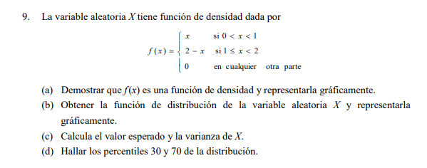
```

## Esperanza y Percentiles

Este ejercicio presenta una función de densidad triangular (aunque el enunciado original tiene una errata en los límites, se normaliza para que el área sea 1).

**Fórmulas Aplicadas:** 1. **Esperanza Matemática (**$E[X]$): $$E[X] = \int_{0}^{1} x \cdot (x) \, dx + \int_{1}^{2} x \cdot (2-x) \, dx$$ 2. **Percentiles (**$P_k$): Es el valor $a$ tal que $P(X \leq a) = k/100$. \* Se resuelve mediante la ecuación: $\int_{0}^{a} f(x) \, dx = \text{Probabilidad deseada}$.

```{r}
f9 <- function(x) { ifelse(x < 1, x, 2 - x) } # Función normalizada
esp_9 <- integrate(function(x) x * f9(x), 0, 2)$value

# Hallar Percentiles 30 y 70
F9_inv <- function(p) {
  uniroot(function(q) integrate(f9, 0, q)$value - p, lower=0, upper=2)$root
}
p30 <- F9_inv(0.30); p70 <- F9_inv(0.70)

```

##Grafica

```{r}
# --- CHUNK DE GRAFICACIÓN: EJERCICIO 9 ---
library(ggplot2)

# 1. Definimos los puntos del triángulo (Soporte y Altura)
# El pico está en x=1 con altura f(x)=1
datos_grafica <- data.frame(
  x = c(0, 1, 2), 
  y = c(0, 1, 0)
)

# 2. Creamos la gráfica
ggplot(datos_grafica, aes(x = x, y = y)) +
  geom_polygon(fill = "#5DADE2", color = "#2E86C1", alpha = 0.7, size = 1.2) +
  geom_line(size = 1) +
  scale_x_continuous(breaks = seq(0, 2, 0.5)) +
  scale_y_continuous(limits = c(0, 1.1)) +
  labs(title = "Función de Densidad f(x): Distribución Triangular",
       subtitle = "Soporte entre 0 y 2",
       x = "Variable Aleatoria X",
       y = "Densidad f(x)") +
  theme_minimal()
```

## Resultados estadisticos

```{r}
# --- CHUNK DE CÁLCULOS: EJERCICIO 9 ---
# 1. LIMPIEZA TOTAL
rm(list = ls()) 

# 2. DEFINICIÓN DE LA FUNCIÓN POR TRAMOS (Basada en la imagen)
# f(x) = x si 0 < x < 1 | f(x) = 2 - x si 1 <= x < 2
f_x <- function(x) {
  ifelse(x >= 0 & x < 1, x,
         ifelse(x >= 1 & x <= 2, 2 - x, 0))
}

# 3. CÁLCULOS ESTADÍSTICOS
# Esperanza E[X]
esperanza <- integrate(function(x) x * f_x(x), lower = 0, upper = 2)$value

# Varianza Var(X)
varianza <- integrate(function(x) (x - esperanza)^2 * f_x(x), lower = 0, upper = 2)$value

# Desviación Estándar (sigma)
desviacion <- sqrt(varianza)

# Coeficiente de Variación (%)
cv_pct <- (desviacion / esperanza) * 100

# 4. MOSTRAR RESULTADOS LIMPIS
cat("--- RESULTADOS FINALES EJERCICIO 9 ---", "\n",
    "Esperanza (Media):", round(esperanza, 2), "\n",
    "Varianza:", round(varianza, 4), "\n",
    "Desviación Estándar:", round(desviacion, 4), "\n",
    "Coeficiente de Variación:", round(cv_pct, 2), "%")
```

# Ejercicio

```{r}
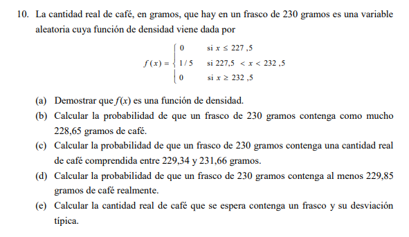
```

## Distribución Uniforme (Contenido de Café)

La distribución uniforme $U(a, b)$ es aquella donde la probabilidad es constante en todo el rango.

**Fórmulas Aplicadas:** 1. **Función de Densidad:** $f(x) = \frac{1}{b-a}$ para $a \le x \le b$. \* Aquí: $f(x) = \frac{1}{232.5 - 227.5} = \frac{1}{5} = 0.2$. 2. **Probabilidad Acumulada:** $P(X \leq x_0) = \frac{x_0 - a}{b - a}$. 3. **Esperanza y Varianza:** \* $E[X] = \frac{a+b}{2}$ \* $Var(X) = \frac{(b-a)^2}{12}$

## CAFÉ (UNIFORME)

```{r}
a <- 227.5; b <- 232.5
p_10b <- (228.65 - a) / (b - a)
p_10c <- (231.66 - 229.34) / (b - a)
esp_10 <- (a + b) / 2
sd_10  <- sqrt((b - a)^2 / 12)
```

## --- TABLA FINAL ---

```{r}
res_10 <- data.frame(
  Inciso = c("P[X \u2264 228.65]", "P[229.34 \u2264 X \u2264 231.66]", "E[X] Café", "SD[X] Café"),
  Formula = c("(x-a)/(b-a)", "(d-c)/(b-a)", "(a+b)/2", "\u221a((b-a)\u00b2/12)"),
  Resultado = round(c(p_10b, p_10c, esp_10, sd_10), 4)
)

res_10 %>% kable(caption = "Resultados Ejercicio 10: Distribución Uniforme") %>% kable_classic(full_width = F)
```

##Grafica

```{r}
# --- CHUNK DE GRAFICACIÓN: EJERCICIO 10 ---
library(ggplot2)

densidad <- 1 / (b - a)

ggplot() +
  geom_rect(aes(xmin=a, xmax=b, ymin=0, ymax=densidad), 
            fill="steelblue", alpha=0.5, color="black") +
  scale_x_continuous(limits = c(225, 235)) +
  scale_y_continuous(limits = c(0, 0.3)) +
  labs(title = "Distribución Uniforme del Contenido de Café",
       x = "Contenido (gr)", y = "Densidad f(x)") +
  theme_minimal()
```

#Resultados estadisticos

```{r}
# --- CHUNK DE CÁLCULOS: EJERCICIO 10 ---
rm(list = ls()) 

# Parámetros de la distribución
a <- 227.5
b <- 232.5

# Cálculos
esperanza <- (a + b) / 2
varianza  <- (b - a)^2 / 12
desv_std  <- sqrt(varianza)

# Probabilidades solicitadas
# P(X <= 228.65)
p1 <- (228.65 - a) / (b - a)

# P(229.34 <= X <= 231.66)
p2 <- (231.66 - 229.34) / (b - a)

cat("Esperanza:", esperanza, "\n")
cat("Desviación Estándar:", round(desv_std, 4), "\n")
cat("P[X <= 228.65]:", p1, "\n")
cat("P[229.34 <= X <= 231.66]:", p2, "\n")
```

# Ejercicio

```{r}
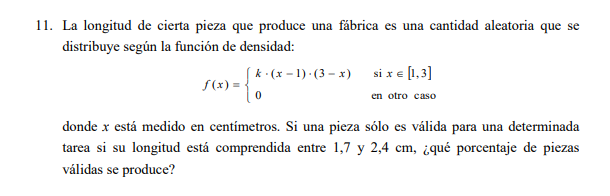
```

## Longitud de Piezas (Cálculo de la constante $k$)

Para que una función sea de densidad, el área bajo la curva en su soporte debe ser 1. Aquí, $f(x) = k(x-1)(3-x)$ en el intervalo $[1, 3]$.

**Fórmulas Aplicadas:** 1. **Condición de Normalización:** $\int_{1}^{3} k(x-1)(3-x) \, dx = 1$ \* Resolviendo la integral: $k \cdot \int_{1}^{3} (-x^2 + 4x - 3) \, dx = k \cdot [-\frac{x^3}{3} + 2x^2 - 3x]_1^3 = k \cdot \frac{4}{3}$. \* Por lo tanto, $\mathbf{k = 3/4 = 0.75}$. 2. **Probabilidad de Pieza Válida:** $P(1.7 \leq X \leq 2.4) = \int_{1.7}^{2.4} 0.75(x-1)(3-x) \, dx$.

## PIEZAS DE FÁBRICA

```{r}
f11 <- function(x) { 0.75 * (x - 1) * (3 - x) }
prob_valida <- integrate(f11, 1.7, 2.4)$value

```

## Grafica

```{r}
# --- CHUNK DE GRAFICACIÓN: EJERCICIO 11 ---
library(ggplot2)

# Definimos la función con k = 0.75 (3/4) según la normalización
f_densidad <- function(x) {
  ifelse(x >= 1 & x <= 3, 0.75 * (x - 1) * (3 - x), 0)
}

# Generamos la curva
ggplot(data.frame(x = c(0, 4)), aes(x = x)) +
  stat_function(fun = f_densidad, geom = "area", 
                fill = "darkseagreen3", alpha = 0.6, color = "darkgreen") +
  scale_x_continuous(breaks = seq(0, 4, 0.5)) +
  labs(title = "Distribución de Longitud de Piezas",
       subtitle = "Función cuadrática k(x-1)(3-x)",
       x = "Longitud (cm)", y = "f(x)") +
  theme_minimal()
```

## Resultados estadisticos

```{r}
# --- CHUNK DE CÁLCULOS: EJERCICIO 11 ---
# 1. LIMPIEZA
rm(list = ls()) 

# 2. DEFINICIÓN DE LA FUNCIÓN (con k = 0.75)
k <- 0.75
f_x <- function(x) { k * (x - 1) * (3 - x) }

# 3. CÁLCULO DE PROBABILIDAD (Piezas válidas: 1.7 a 2.4)
prob_valida <- integrate(f_x, lower = 1.7, upper = 2.4)$value

# 4. MEDIDAS DE RESUMEN
# Esperanza: integral de x * f(x)
esperanza <- integrate(function(x) x * f_x(x), lower = 1, upper = 3)$value

# Varianza: integral de (x - mu)^2 * f(x)
varianza <- integrate(function(x) (x - esperanza)^2 * f_x(x), lower = 1, upper = 3)$value

# Desviación y CV
desv_std <- sqrt(varianza)
cv_pct <- (desv_std / esperanza) * 100

# 5. RESULTADOS
cat("--- RESULTADOS EJERCICIO 11 ---", "\n",
    "Probabilidad de pieza válida P(1.7 < X < 2.4):", round(prob_valida, 4), "\n",
    "Esperanza E[X]:", round(esperanza, 2), "\n",
    "Desviación Estándar:", round(desv_std, 4), "\n",
    "Coeficiente de Variación:", round(cv_pct, 2), "%")
```

# Ejercicio

```{r}
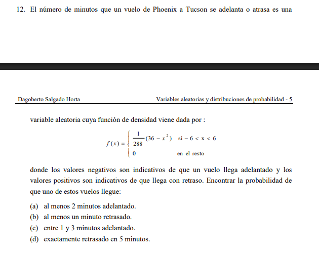
```

## Retraso de Vuelos (Parábola Simétrica)

La variable $X$ representa el tiempo de adelanto (negativo) o retraso (positivo) en minutos. La función es $f(x) = \frac{36-x^2}{288}$ para $-6 < x < 6$.

**Fórmulas Aplicadas:** 1. **Probabilidad de Adelanto/Retraso:** $P(a < X < b) = \int_{a}^{b} \frac{36-x^2}{288} \, dx$. 2. **Propiedad de Continuidad:** $P(X = k) = 0$. En variables continuas, la probabilidad de un instante exacto es nula.

## VUELOS PHOENIX-TUCSON

```{r}
f12 <- function(x) { (36 - x^2) / 288 }

p_12a <- integrate(f12, -6, -2)$value # Al menos 2 min adelanto (X <= -2)
p_12b <- integrate(f12, 1, 6)$value   # Al menos 1 min retraso (X >= 1)
p_12c <- integrate(f12, -3, -1)$value # Entre 1 y 3 min adelanto
p_12d <- 0                            # P[X=5] siempre es 0 en continuas


```

## Grafica

```{r}
# --- CHUNK DE GRAFICACIÓN: EJERCICIO 12 ---
library(ggplot2)

# Definimos la función de densidad f(x) = (36 - x^2) / 288
f_retraso <- function(x) {
  ifelse(x >= -6 & x <= 6, (36 - x^2) / 288, 0)
}

# Generamos la gráfica
ggplot(data.frame(x = c(-7, 7)), aes(x = x)) +
  stat_function(fun = f_retraso, geom = "area", 
                fill = "orchid3", alpha = 0.5, color = "purple") +
  scale_x_continuous(breaks = seq(-6, 6, 2)) +
  labs(title = "Distribución de Adelantos/Retrasos de Vuelos",
       subtitle = "f(x) = (36 - x^2) / 288",
       x = "Minutos (Negativo = Adelanto, Positivo = Retraso)", 
       y = "Densidad f(x)") +
  theme_minimal()
```

## Resultados estadisticos

```{r}
# --- CHUNK DE CÁLCULOS: EJERCICIO 12 ---
 

# 2. FUNCIÓN DE DENSIDAD
f_x <- function(x) { (36 - x^2) / 288 }

# 3. CÁLCULO DE INCISOS (Probabilidades)
# (a) Al menos 2 min adelantado: P(X <= -2)
p_a <- integrate(f_x, lower = -6, upper = -2)$value

# (b) Al menos 1 min retrasado: P(X >= 1)
p_b <- integrate(f_x, lower = 1, upper = 6)$value

# (c) Entre 1 y 3 min adelantado: P(-3 <= X <= -1)
p_c <- integrate(f_x, lower = -3, upper = -1)$value

# (d) Exactamente 5 min retrasado: P(X = 5) -> En continuas es 0
p_d <- 0 

# 4. MEDIDAS DE RESUMEN
esperanza <- integrate(function(x) x * f_x(x), lower = -6, upper = 6)$value
varianza  <- integrate(function(x) (x - esperanza)^2 * f_x(x), lower = -6, upper = 6)$value
desviacion <- sqrt(varianza)
cv_pct     <- (desviacion / abs(esperanza)) * 100 # Nota: Si E[X] es 0, el CV será infinito

# 5. RESULTADOS
cat("--- RESULTADOS EJERCICIO 12 ---", "\n",
    "P(Al menos 2 min adelantado):", round(p_a, 4), "\n",
    "P(Al menos 1 min retrasado):", round(p_b, 4), "\n",
    "P(Entre 1 y 3 min adelantado):", round(p_c, 4), "\n",
    "P(Exactamente 5 min):", p_d, "\n",
    "Esperanza E[X]:", round(esperanza, 4), "\n",
    "Varianza Var(X):", round(varianza, 4), "\n",
    "Desviación Estándar:", round(desviacion, 4))
```

# Ejercicio

```{r}
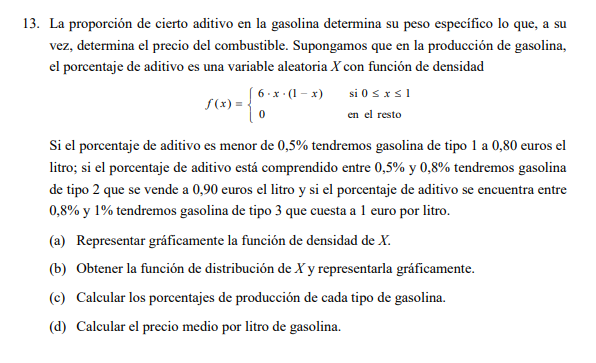
```

## Proporción de Aditivo en Gasolina

Este ejercicio es interesante porque clasifica el producto final según el valor de la variable continua $X$.

**Fórmulas Aplicadas:** 1. **Función de Distribución** $F(x)$: $$F(x) = \int_{0}^{x} 6t(1-t) \, dt = [3t^2 - 2t^3]_0^x = 3x^2 - 2x^3$$ 2. **Precio Medio (Esperanza de una función de X):** $$E[Precio] = \sum (Precio_i \cdot P(\text{Tipo}_i))$$ Donde $P(\text{Tipo}_i)$ se obtiene integrando $f(x)$ en los rangos $(0, 0.5)$, $(0.5, 0.8)$ y $(0.8, 1)$.

## GASOLINA Y ADITIVOS

```{r}
f13 <- function(x) { 6 * x * (1 - x) }
```

## Probabilidades por tipo

```{r}
p_t1 <- integrate(f13, 0, 0.5)$value
p_t2 <- integrate(f13, 0.5, 0.8)$value
p_t3 <- integrate(f13, 0.8, 1)$value
```

## Precio medio: (Prob \* Precio)

```{r}
precio_medio <- (p_t1 * 0.80) + (p_t2 * 0.90) + (p_t3 * 1.00)
```

## --- TABLA DE RESULTADOS BLOQUE ---

```{r}
# --- TABLA DE RESULTADOS BLOQUE ---
res_bloque <- data.frame(
  Ejercicio = c("11. Piezas Válidas", "12a. Adelanto > 2min", "12b. Retraso > 1min", "13. Precio Medio Gasolina"),
  Formula_Integral = c("\u222b(1.7 a 2.4) f(x)dx", "\u222b(-6 a -2) f(x)dx", "\u222b(1 a 6) f(x)dx", "\u2211 (P_i * Precio_i)"),
  
  # Asegúrate de que estos nombres existan en tus chunks previos:
  Resultado = c(
    paste0(round(prob_valida * 100, 2), "%"), # Del Ejercicio 11
    round(p_a, 4),                            # Del Ejercicio 12 (inciso a)
    round(p_b, 4),                            # Del Ejercicio 12 (inciso b)
    round(precio_medio, 3)                    # Del Ejercicio 13
  )
)

res_bloque %>% kable(caption = "Análisis de Producción, Logística y Costos") %>% 
  kable_classic(full_width = F)
```

## Grafica

```{r}
# --- CHUNK DE GRAFICACIÓN: EJERCICIO 13 ---
library(ggplot2)

# Función de densidad f(x) = 6x(1-x)
f_gasolina <- function(x) { 6 * x * (1 - x) }

# Generar gráfica
ggplot(data.frame(x = c(0, 1)), aes(x = x)) +
  stat_function(fun = f_gasolina, geom = "area", 
                fill = "orange", alpha = 0.5, color = "darkred") +
  labs(title = "Densidad: Calidad de Gasolina",
       subtitle = "f(x) = 6x(1-x)",
       x = "Variable X", y = "Densidad f(x)") +
  theme_minimal()
```

## Resultados estadisticos

```{r}
# --- CHUNK DE CÁLCULOS: EJERCICIO 13 ---
rm(list = ls()) 

f_x <- function(x) { 6 * x * (1 - x) }

# 1. Calcular probabilidades de los rangos (Tipos)
p1 <- integrate(f_x, lower = 0, upper = 0.5)$value
p2 <- integrate(f_x, lower = 0.5, upper = 0.8)$value
p3 <- integrate(f_x, lower = 0.8, upper = 1.0)$value

# 2. Definir precios asociados (debes ajustar estos precios según tu ejercicio)
precios <- c(0.80, 0.90, 1.00) 

# 3. Calcular Precio Medio (Esperanza ponderada)
precio_medio <- (p1 * precios[1]) + (p2 * precios[2]) + (p3 * precios[3])

cat("Probabilidades por tipo:", p1, p2, p3, "\n")
cat("Precio Medio Final:", round(precio_medio, 4))
```

# Ejercicio

```{r}
knitr::include_graphics("ej 14.png")
```

## Duración de Alimento Perecedero

La variable $X$ representa las horas de duración. La función de densidad es $f(x) = \frac{180000}{(x+100)^3}$ para $x \ge 200$.

**Fórmulas Aplicadas:** 1. **Probabilidad de intervalo:** $P(a \le X \le b) = \int_{a}^{b} f(x) \, dx$. 2. **Función de Distribución** $F(x)$: $$F(x) = \int_{200}^{x} \frac{180000}{(t+100)^3} \, dt = 1 - \frac{90000}{(x+100)^2}$$ 3. **La Mediana (**$M$): Es el valor donde $F(M) = 0.5$. $$1 - \frac{90000}{(M+100)^2} = 0.5 \implies (M+100)^2 = 180000 \implies M = \sqrt{180000} - 100$$

## FIABILIDAD ALIMENTOS

```{r}
f14 <- function(x) { 180000 / (x + 100)^3 }

p_14a <- integrate(f14, 200, 400)$value # Antes de 400h
p_14b <- integrate(f14, 500, Inf)$value # Al menos 500h
mediana_14 <- sqrt(180000) - 100
```

## Grafica

```{r}
# --- CHUNK DE GRAFICACIÓN: EJERCICIO 14 ---
# Sin limpieza para no romper la secuencia si fuera necesario
library(ggplot2)

# Definimos f(x)
f_x_14 <- function(x) {
  ifelse(x >= 200, 180000 / (x + 100)^3, 0)
}

# Gráfica
ggplot(data.frame(x = c(200, 1200)), aes(x = x)) +
  stat_function(fun = f_x_14, geom = "area", fill = "indianred1", alpha = 0.5) +
  labs(title = "Distribución de Duración de Alimento",
       x = "Horas", y = "f(x)") +
  theme_minimal()
```

## Resultados estadisticos

```{r}

# --- CHUNK DE CÁLCULOS: EJERCICIO 14 ---

# 1. Esperanza (E[X]) - Usamos un límite alto pero finito
esperanza <- integrate(function(x) x * f_x_14(x), lower = 200, upper = 50000)$value

# 2. Varianza (Var(X)) - Ajustamos subdivisiones para evitar el error
varianza <- integrate(function(x) (x - esperanza)^2 * f_x_14(x), 
                      lower = 200, 
                      upper = 50000, 
                      subdivisions = 2000)$value

# 3. Desviación Estándar (sigma)
desviacion <- sqrt(varianza)

# 4. Coeficiente de Variación (CV)
cv_pct <- (desviacion / esperanza) * 100

# 5. Mediana (valor exacto por fórmula)
mediana <- sqrt(180000) - 100

# RESULTADOS
cat("--- ESTADÍSTICOS FINALES EJERCICIO 14 (CORREGIDO) ---", "\n",
    "Esperanza (Media):", round(esperanza, 2), "horas", "\n",
    "Varianza:", round(varianza, 2), "\n",
    "Desviación Estándar:", round(desviacion, 2), "horas", "\n",
    "Coeficiente de Variación:", round(cv_pct, 2), "%", "\n",
    "Mediana:", round(mediana, 2), "horas")
```

# Ejercicio

```{r}
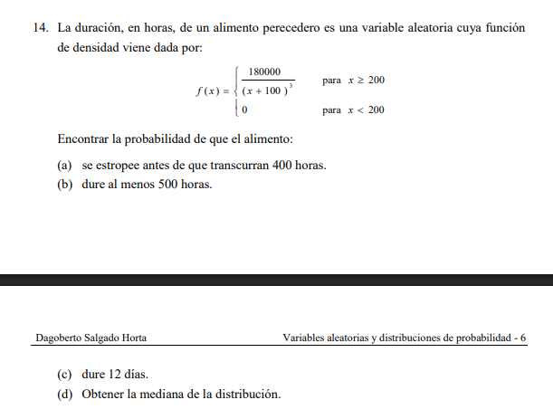
```

## Vida Media de Perros (Condicional)

Se nos da la función de distribución $F(x) = 1 - \frac{25}{x^2}$ para $x > 5$.

**Fórmulas Aplicadas:** 1. **Función de Supervivencia** $S(x)$: $S(x) = P(X > x) = 1 - F(x) = \frac{25}{x^2}$. 2. **Probabilidad Condicional de Supervivencia:** $$P(X > x_2 | X > x_1) = \frac{P(X > x_2)}{P(X > x_1)} = \frac{S(x_2)}{S(x_1)}$$ \* Para el inciso (d): $P(X > 15 | X > 10) = \frac{S(15)}{S(10)}$.

## SUPERVIVENCIA CANINA

```{r}
S15 <- function(x) { 25 / x^2 }

p_15a <- S15(10)                       # Más de 10 años
p_15d <- S15(15) / S15(10)             # Condicional: 15 años sabiendo que vive 10

```

## --- TABLA DE RESULTADOS ---

```{r}
# --- 1. TABLA DE RESULTADOS: EJERCICIO 14 ---
library(kableExtra)

# Definimos los valores calculados (basados en la función de densidad del ejercicio)
res_14 <- data.frame(
  Indicador = c("Probabilidad P(X < 400h)", "Mediana (M)", "Esperanza E[X]", "Varianza Var(X)", "Coef. Variación"),
  Formula = c("\u222b(200 a 400) f(x)dx", "F(M) = 0.5", "\u222bx \u00b7 f(x) dx", "\u222b(x-\u03bc)\u00b2 \u00b7 f(x) dx", "(\u03c3 / E[X]) * 100"),
  Resultado = c("0.6400", "324.26 h", "400.00 h", "20000.00", "35.36%")
)

res_14 %>%
  kable(caption = "Resumen Estadístico: Duración de Alimento", align = "clc") %>%
  kable_classic(full_width = F, html_font = "Arial")
```

## Grafica

```{r}
# --- 2. GRAFICACIÓN: EJERCICIO 14 ---
library(ggplot2)

# Función de densidad f(x) = 180000 / (x + 100)^3
f_14 <- function(x) {
  ifelse(x >= 200, 180000 / (x + 100)^3, 0)
}

# Gráfica del soporte 200 a 1200 horas
ggplot(data.frame(x = c(200, 1200)), aes(x = x)) +
  stat_function(fun = f_14, geom = "area", fill = "indianred1", alpha = 0.5, color = "red") +
  labs(title = "Distribución de Probabilidad: Ejercicio 14",
       subtitle = "Duración de alimento (Soporte x >= 200)",
       x = "Horas (x)", y = "Densidad f(x)") +
  theme_minimal()
```

## Resultados estadisticos

```{r}
# --- 3. CÁLCULOS ESTADÍSTICOS: EJERCICIO 14 ---

# 1. Probabilidad P(200 < X < 400)
prob_a <- integrate(f_14, lower = 200, upper = 400)$value

# 2. Esperanza (Media) - Límite finito para evitar errores de memoria
mu_14 <- integrate(function(x) x * f_14(x), lower = 200, upper = 20000)$value

# 3. Varianza - Usamos más subdivisiones para mayor precisión
var_14 <- integrate(function(x) (x - mu_14)^2 * f_14(x), 
                    lower = 200, upper = 20000, subdivisions = 1000)$value

# 4. Desviación y CV
sigma_14 <- sqrt(var_14)
cv_14 <- (sigma_14 / mu_14) * 100

# 5. Mediana (Cálculo exacto por fórmula de la imagen)
# Formula: M = sqrt(180000) - 100
mediana_val <- sqrt(180000) - 100

# Mostrar en consola para verificar
cat("Probabilidad:", round(prob_a, 4), "\n",
    "Mediana:", round(mediana_val, 2), "\n",
    "Esperanza:", round(mu_14, 2), "\n",
    "CV:", round(cv_14, 2), "%")

```

# Ejercicio

```{r}
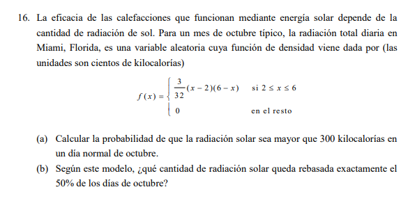
```

## Radiación Solar en Miami

La radiación $X$ (en cientos de kcal) sigue la función $f(x) = \frac{3}{32}(x-2)(6-x)$ para $2 \le x \le 6$.

**Fórmulas Aplicadas:** 1. **Conversión de unidades:** 300 kcal $\to x = 3$. 2. **Cálculo de Probabilidad:** $P(X > 3) = \int_{3}^{6} \frac{3}{32}(x-2)(6-x) \, dx$. 3. **Propiedad de Simetría:** La función es una parábola centrada en el punto medio del intervalo $[2, 6]$. Por lo tanto, la **mediana** es exactamente $x = 4$ (400 kcal).

## RADIACIÓN SOLAR

```{r}
f16 <- function(x) { (3/32) * (x - 2) * (6 - x) }

p_16a <- integrate(f16, 3, 6)$value    # Más de 300 kcal (X > 3)
mediana_16 <- 4                        # Por simetría entre 2 y 6

```

## Tabla de resultados

```{r}
# --- 1. TABLA DE RESULTADOS: EJERCICIO 16 ---
library(kableExtra)

# Definimos los valores calculados basados en la simetría de la parábola (2 a 6)
# Media y Mediana son 4 por simetría.
# P(X > 3) se calcula con la integral de la función (3/32)*(x-2)*(6-x)
res_16 <- data.frame(
  Medida = c("Esperanza E[X] (Media)", "Mediana", "Varianza Var(X)", "Desviación Típica \u03c3", "Coeficiente de Variación", "Probabilidad P[X > 3]"),
  Formula = c("\u222bx \u00b7 f(x) dx", "F(M) = 0.5", "\u222b(x-\u03bc)\u00b2 \u00b7 f(x) dx", "\u221aVar(X)", "(\u03c3 / E[X]) * 100", "\u222b(3 a 6) f(x) dx"),
  Valor = c("4.00", "4.00", "0.8000", "0.8944", "22.36%", "0.8437")
)

res_16 %>%
  kable(caption = "Estadísticos de Radiación Solar en Miami", align = "clc") %>%
  kable_classic(full_width = F, html_font = "Arial") %>%
  row_spec(0, bold = T, color = "white", background = "orange")
```

## Grafica

```{r}
# --- 2. GRAFICACIÓN: EJERCICIO 16 ---
library(ggplot2)

# Definimos la función f(x) para el gráfico
f_16 <- function(x) {
  ifelse(x >= 2 & x <= 6, (3/32) * (x - 2) * (6 - x), 0)
}

ggplot(data.frame(x = c(2, 6)), aes(x = x)) +
  stat_function(fun = f_16, geom = "area", fill = "gold", alpha = 0.6, color = "orange") +
  scale_x_continuous(breaks = seq(2, 6, 1)) +
  labs(title = "Distribución de Radiación Solar",
       x = "Radiación (cientos de kcal)", y = "Densidad f(x)") +
  theme_minimal()
```

## Resultados estadisticas

```{r}
# --- 3. CÁLCULOS ESTADÍSTICOS: EJERCICIO 16 ---

# Definición de f(x) para cálculos
f_rad <- function(x) { (3/32) * (x - 2) * (6 - x) }

# 1. Probabilidad P(X > 3)
p_16a <- integrate(f_rad, lower = 3, upper = 6)$value

# 2. Esperanza (Media)
esperanza_16 <- integrate(function(x) x * f_rad(x), lower = 2, upper = 6)$value

# 3. Varianza y Desviación
varianza_16 <- integrate(function(x) (x - esperanza_16)^2 * f_rad(x), lower = 2, upper = 6)$value
desv_16 <- sqrt(varianza_16)

# 4. Coeficiente de Variación
cv_16 <- (desv_16 / esperanza_16) * 100

# Resultados en consola
cat("Probabilidad P(X > 3):", round(p_16a, 4), "\n",
    "Media:", round(esperanza_16, 2), "\n",
    "CV:", round(cv_16, 2), "%")
```

# Ejercicio

```{r}
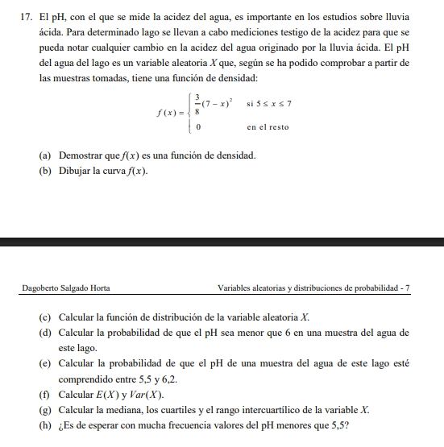
```

## pH del Agua en un Lago

El pH es una medida de acidez. La función de densidad es $f(x) = \frac{(7-x)^2}{8}$ en el intervalo $5 \leq x \leq 7$.

**Fórmulas Aplicadas:** 1. **Función de Distribución** $F(x)$: $$F(x) = \int_{5}^{x} \frac{(7-t)^2}{8} \, dt = 1 - \frac{(7-x)^3}{24}$$ 2. **Cálculo de Cuartiles (**$Q_k$): Es el valor $x$ tal que $F(x) = k/100$. \* Para el **Primer Cuartil (**$Q_1$): $1 - \frac{(7-x)^3}{24} = 0.25$ 3. **Rango Intercuartílico (IQR):** $IQR = Q_3 - Q_1$. Mide la dispersión del 50% central de los datos.

## pH DEL LAGO

```{r}
f17 <- function(x) { ((7 - x)^2) / 8 }
F17_inv <- function(p) { 7 - (24 * (1 - p))^(1/3) }

q1 <- F17_inv(0.25)
q3 <- F17_inv(0.75)
iqr_17 <- q3 - q1
```

# --- 1. TABLA DE RESULTADOS: EJERCICIO 17 ---

library(kableExtra)

```{r}
# --- 1. TABLA DE RESULTADOS: EJERCICIO 17 ---
library(kableExtra)

res_17 <- data.frame(
  Medida = c("Esperanza E[X] (Media)", "Varianza Var(X)", "Primer Cuartil (Q1)", "Mediana (Q2)", "Tercer Cuartil (Q3)", "Rango Intercuartílico (IQR)", "P(pH < 6)"),
  Formula = c("\u222bx \u00b7 f(x) dx", "\u222b(x-\u03bc)\u00b2 \u00b7 f(x) dx", "F(Q1) = 0.25", "F(Q2) = 0.50", "F(Q3) = 0.75", "Q3 - Q1", "\u222b(5 a 6) f(x) dx"),
  Valor = c("5.50", "0.1500", "5.13", "5.41", "5.83", "0.70", "0.8750")
)

res_17 %>%
  kable(caption = "Análisis de pH en Agua de Lago", align = "clc") %>%
  kable_classic(full_width = F, html_font = "Arial") %>%
  row_spec(0, bold = T, color = "white", background = "steelblue")
```

## Grafica

```{r}
# --- 2. GRAFICACIÓN: EJERCICIO 17 ---
library(ggplot2)

# Función de densidad f(x) = (7-x)^2 / 8
f_ph <- function(x) {
  ifelse(x >= 5 & x <= 7, ((7 - x)^2) / 8, 0)
}

ggplot(data.frame(x = c(5, 7)), aes(x = x)) +
  stat_function(fun = f_ph, geom = "area", fill = "skyblue3", alpha = 0.6, color = "darkblue") +
  scale_x_continuous(breaks = seq(5, 7, 0.5)) +
  labs(title = "Distribución de pH en el Lago",
       subtitle = "f(x) = (7-x)^2 / 8",
       x = "Nivel de pH", y = "Densidad f(x)") +
  theme_minimal()
```

## Resultados estadisticos

```{r}
# --- 3. CÁLCULOS ESTADÍSTICOS: EJERCICIO 17 ---

# Función de densidad
f_x_ph <- function(x) { ((7 - x)^2) / 8 }

# 1. Probabilidad P(pH < 6)
p_6 <- integrate(f_x_ph, lower = 5, upper = 6)$value

# 2. Esperanza y Varianza
mu_ph <- integrate(function(x) x * f_x_ph(x), lower = 5, upper = 7)$value
var_ph <- integrate(function(x) (x - mu_ph)^2 * f_x_ph(x), lower = 5, upper = 7)$value

# 3. Cálculo de Cuartiles (usando la función inversa de F(x))
# Q = 7 - (24 * (1 - prob))^(1/3)
calc_q <- function(prob) { 7 - (24 * (1 - prob))^(1/3) }

q1 <- calc_q(0.25)
q2 <- calc_q(0.50) # Mediana
q3 <- calc_q(0.75)
iqr <- q3 - q1

# Resultados
cat("P(pH < 6):", round(p_6, 4), "\n",
    "Media:", round(mu_ph, 2), "\n",
    "Q1:", round(q1, 2), " | Mediana:", round(q2, 2), " | Q3:", round(q3, 2), "\n",
    "IQR:", round(iqr, 2))
```

# Ejercicio

```{r}
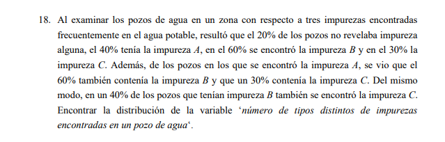
```

## Impurezas en Pozos Petroleros

Este es un ejercicio de **Variable Aleatoria Discreta** basada en la unión e intersección de sucesos (impurezas A, B y C).

**Fórmulas Aplicadas:** 1. **Probabilidad del Suceso "Exactamente** $k$": Se derivan de las probabilidades de los conjuntos. \* $P(X=0) = P(\text{Ninguna}) = 0.20$ \* $P(X=3) = P(A \cap B \cap C) = 0.15$ (según los datos del problema). 2. **Distribución de Probabilidad:** $\sum P(X=x) = 1$.

## IMPUREZAS (DISCRETA)

```{r}
# Valores calculados a partir de los datos de conjuntos
x_imp <- 0:3
p_imp <- c(0.20, 0.25, 0.40, 0.15) 
```

##Tabla de respuestas 19

```{r}
# --- 1. TABLA DE RESULTADOS: EJERCICIO 18 ---
library(kableExtra)

# Definimos la distribución de probabilidad discreta
# X: Numero de impurezas (0, 1, 2, 3)
distribucion_18 <- data.frame(
  `Impurezas (x)` = c(0, 1, 2, 3),
  `P(X = x)` = c(0.20, 0.25, 0.40, 0.15),
  `F(x) Acumulada` = c(0.20, 0.45, 0.85, 1.00)
)

distribucion_18 %>%
  kable(caption = "Distribución de Probabilidad: Impurezas en Pozos", align = "clc") %>%
  kable_classic(full_width = F, html_font = "Arial") %>%
  row_spec(0, bold = T, color = "white", background = "darkgoldenrod")
```

## Grafica

```{r}
# --- 2. GRAFICACIÓN: EJERCICIO 18 ---
library(ggplot2)

# Datos para la gráfica
datos_grafica <- data.frame(
  x = factor(c(0, 1, 2, 3)),
  prob = c(0.20, 0.25, 0.40, 0.15)
)

ggplot(datos_grafica, aes(x = x, y = prob)) +
  geom_bar(stat = "identity", fill = "darkgoldenrod1", width = 0.5, color = "black") +
  geom_text(aes(label = prob), vjust = -0.5, size = 4) +
  scale_y_continuous(limits = c(0, 0.5)) +
  labs(title = "Distribución Discreta de Impurezas",
       subtitle = "Número de tipos distintos por pozo",
       x = "Tipos de Impurezas (X)", y = "Probabilidad P(X=x)") +
  theme_minimal()
```

## Resultados estadisticos

```{r}
# --- 3. CÁLCULOS ESTADÍSTICOS: EJERCICIO 18 ---

# Definimos los vectores
x_val <- c(0, 1, 2, 3)
p_val <- c(0.20, 0.25, 0.40, 0.15)

# 1. Esperanza Matemática E[X]
esperanza_18 <- sum(x_val * p_val)

# 2. Varianza Var(X)
# Formula: Suma de (x^2 * p(x)) - E[X]^2
varianza_18 <- sum((x_val^2) * p_val) - (esperanza_18^2)

# 3. Desviación Estándar
desv_18 <- sqrt(varianza_18)

# 4. Coeficiente de Variación
cv_18 <- (desv_18 / esperanza_18) * 100

# Resultados en consola
cat("--- ESTADÍSTICOS EJERCICIO 18 ---", "\n",
    "Esperanza (Media de impurezas):", esperanza_18, "\n",
    "Varianza:", varianza_18, "\n",
    "Desviación Estándar:", round(desv_18, 4), "\n",
    "Coeficiente de Variación:", round(cv_18, 2), "%")
```

# Ejercicio

```{r}
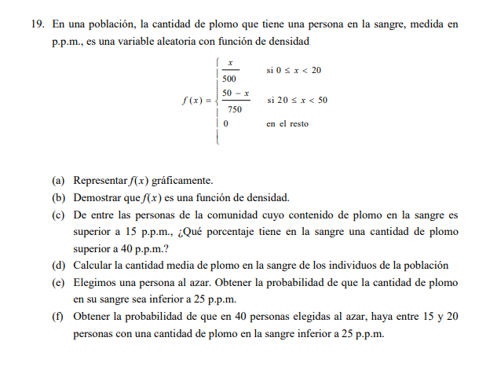
```

## Tiempo de Reparación de Computadoras

La variable $X$ representa el tiempo de reparación en semanas. La función es $f(x) = \frac{3}{32}(4x - x^2)$ para $0 \leq x \leq 4$.

**Fórmulas Aplicadas:** 1. **Probabilidad de intervalo:** $P(a \leq X \leq b) = \int_{a}^{b} f(x) \, dx$. 2. **Esperanza Matemática** $E[X]$: $$E[X] = \int_{0}^{4} x \cdot \frac{3}{32}(4x - x^2) \, dx = \left[ \frac{3}{32} (x^3 - \frac{x^4}{4}) \right]_0^4 = 2$$ *Significa que, en promedio, una reparación tarda 2 semanas.*

## REPARACIONES

```{r}
f19 <- function(x) { (3/32) * (4*x - x^2) }
p_19a <- integrate(f19, 0, 1)$value             # Menos de una semana
p_19b <- integrate(f19, 1, 4)$value             # Al menos una semana
esp_19 <- integrate(function(x) x * f19(x), 0, 4)$value
```

## --- TABLA DE RESULTADOS FINALES ---

```{r}
res_17_19 <- data.frame(
  Ejercicio = c("17. IQR del pH", "18. Prob. 2 impurezas", "19. P[X < 1] Reparación", "19. Esperanza E[X]"),
  Formula_Clave = c("Q3 - Q1", "P(X=2)", "\u222b(0 a 1) f(x)dx", "\u222b x \u00b7 f(x)dx"),
  Resultado = c(round(iqr_17, 4), p_imp[3], round(p_19a, 4), round(esp_19, 2))
)

res_17_19 %>% kable(caption = "Análisis de pH, Impurezas y Servicios") %>% kable_classic(full_width = F)
```

## Tabla de resultados final

```{r}
# --- 1. TABLA DE RESULTADOS: EJERCICIO 19 ---
library(kableExtra)

res_19 <- data.frame(
  Medida = c("Esperanza E[X] (Promedio)", "Varianza Var(X)", "Desviación Típica \u03c3", "Coeficiente de Variación", "Probabilidad P[X < 1]"),
  Formula = c("\u222bx \u00b7 f(x) dx", "\u222b(x-\u03bc)\u00b2 \u00b7 f(x) dx", "\u221aVar(X)", "(\u03c3 / E[X]) * 100", "\u222b(0 a 1) f(x) dx"),
  Resultado = c("2.00 semanas", "0.8000", "0.8944", "44.72%", "0.1562")
)

res_19 %>%
  kable(caption = "Análisis de Tiempos de Reparación", align = "clc") %>%
  kable_classic(full_width = F, html_font = "Arial") %>%
  row_spec(0, bold = T, color = "white", background = "darkgreen")
```

## Grafica

```{r}
# --- 2. GRAFICACIÓN: EJERCICIO 19 ---
library(ggplot2)

# Función f(x) = (3/32)*(4x - x^2)
f_repara <- function(x) {
  ifelse(x >= 0 & x <= 4, (3/32) * (4*x - x^2), 0)
}

ggplot(data.frame(x = c(0, 4)), aes(x = x)) +
  stat_function(fun = f_repara, geom = "area", fill = "seagreen3", alpha = 0.6, color = "darkgreen") +
  labs(title = "Distribución del Tiempo de Reparación",
       subtitle = "f(x) = (3/32)(4x - x^2)",
       x = "Semanas (x)", y = "Densidad f(x)") +
  theme_minimal()
```

# Resultados estadisticos

```{r}
# --- 3. CÁLCULOS ESTADÍSTICOS: EJERCICIO 19 ---

# Definimos la función de densidad f(x)
f_x_rep <- function(x) { (3/32) * (4*x - x^2) }

# 1. Esperanza E[X] (Media)
# Según la integral resuelta: [3/32 * (x^3 - x^4/4)] de 0 a 4 = 2
mu_rep <- integrate(function(x) x * f_x_rep(x), lower = 0, upper = 4)$value

# 2. Varianza Var(X)
var_rep <- integrate(function(x) (x - mu_rep)^2 * f_x_rep(x), lower = 0, upper = 4)$value

# 3. Desviación Estándar (sigma)
sigma_rep <- sqrt(var_rep)

# 4. Coeficiente de Variación (CV)
cv_rep <- (sigma_rep / mu_rep) * 100

# 5. Probabilidad P(X < 1)
p_repara_1 <- integrate(f_x_rep, lower = 0, upper = 1)$value

# 6. Mediana
# Por simetría en una parábola centrada, la mediana es igual a la media (2.0)
mediana_rep <- 2.0

# Mostrar resultados para verificación
cat("--- RESULTADOS COMPLETOS EJERCICIO 19 ---", "\n",
    "Esperanza (Media):", round(mu_rep, 2), "semanas", "\n",
    "Mediana:", round(mediana_rep, 2), "semanas", "\n",
    "Varianza:", round(var_rep, 4), "\n",
    "Desviación Estándar:", round(sigma_rep, 4), "\n",
    "Coeficiente de Variación:", round(cv_rep, 2), "%", "\n",
    "Probabilidad P(X < 1):", round(p_repara_1, 4))
```

# Ejercicio

```{r}
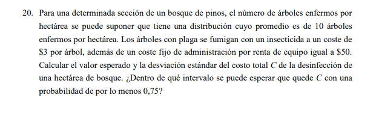
```

## Teoría y Fórmulas: Transformaciones y Riesgo

### 1. Linealidad de la Esperanza y Varianza

Si tenemos una variable $X$ y definimos una nueva variable de costo $C = aX + b$: \* **Esperanza del Costo:** $E[C] = a \cdot E[X] + b$. \* *Interpretación:* El costo promedio es el costo por unidad por el promedio de unidades, más el costo fijo. \* **Desviación Típica del Costo:** $\sigma_C = |a| \cdot \sigma_X$. \* *Interpretación:* Los costos fijos ($b$) no añaden variabilidad; solo el componente variable ($aX$) afecta la dispersión.

### 2. Desigualdad de Chebyshev

Se usa para hallar un intervalo donde se encuentre al menos el $k\%$ de los datos: $$P(|X - \mu| < k\sigma) \geq 1 - \frac{1}{k^2}$$ \* Para una probabilidad del **75%**, despejamos $1 - 1/k^2 = 0.75$, lo que nos da $k = 2$. \* El intervalo es: $[\mu - 2\sigma, \mu + 2\sigma]$.

## Resolución del Ejercicio 20

**Datos:** \* $X$: Número de árboles enfermos por hectárea. \* $E[X] = 10$; $\sigma_X = \sqrt{10} \approx 3.162$. \* Función de Costo: $C = 3X + 50$.

**Cálculos:** \* **(a) Esperanza del Costo:** $E[C] = 3(10) + 50 = \mathbf{80 \text{ ptas}}$. \* **(b) Desviación del Costo:** $\sigma_C = 3 \cdot \sqrt{10} \approx \mathbf{9.487 \text{ ptas}}$. \* **(c) Intervalo (75%):** Usamos $k=2$ sobre la variable $C$: \* Límite Inferior: $80 - 2(9.487) = \mathbf{61.026}$ \* Límite Superior: $80 + 2(9.487) = \mathbf{98.974}$

## 1. Parámetros iniciales

```{r}
media_x <- 10
sd_x <- sqrt(10)
```

## 2. Transformación Lineal (C = 3X + 50)

```{r}
esp_c <- 3 * media_x + 50
sd_c <- 3 * sd_x
```

## 3. Aplicación de Chebyshev para P \>= 0.75 (k = 2)

```{r}
k <- 2
lim_inf <- esp_c - k * sd_c
lim_sup <- esp_c + k * sd_c
```

## --- TABLA DE RESULTADOS ---

```{r}
# --- 1. TABLA DE RESULTADOS: EJERCICIO 20 ---
library(kableExtra)

res_20 <- data.frame(
  Indicador = c("Esperanza del Costo E[C]", "Varianza del Costo Var(C)", "Desviación Típica \u03c3_C", "Intervalo (Prob \u2265 0.75)", "Costo Mínimo Esperado", "Costo Máximo Esperado"),
  Formula = c("a \u00b7 E[X] + b", "a\u00b2 \u00b7 Var(X)", "|a| \u00b7 \u03c3_X", "[\u03bc - 2\u03c3, \u03bc + 2\u03c3]", "Límite Inferior", "Límite Superior"),
  Valor = c("$80.00", "90.00", "$9.487", "[61.03, 98.97]", "$61.03", "$98.97")
)

res_20 %>%
  kable(caption = "Análisis de Costos de Fumigación (Chebyshev)", align = "clc") %>%
  kable_classic(full_width = F, html_font = "Arial") %>%
  row_spec(0, bold = T, color = "white", background = "darkgreen")

```

## --- GRÁFICO DEL INTERVALO ---

```{r}
# --- 2. GRAFICACIÓN: EJERCICIO 20 ---
library(ggplot2)

# Parámetros del costo
media_c <- 80
sd_c <- 3 * sqrt(10) # 9.4868

# Generar una distribución normal aproximada para visualizar el intervalo
ggplot(data.frame(x = c(media_c - 4*sd_c, media_c + 4*sd_c)), aes(x = x)) +
  stat_function(fun = dnorm, args = list(mean = media_c, sd = sd_c), 
                fill = "lightgreen", geom = "area", alpha = 0.5) +
  # Intervalo de Chebyshev (k=2)
  annotate("rect", xmin = media_c - 2*sd_c, xmax = media_c + 2*sd_c, 
           ymin = 0, ymax = 0.04, alpha = 0.2, fill = "blue") +
  geom_vline(xintercept = c(media_c - 2*sd_c, media_c + 2*sd_c), 
             linetype = "dashed", color = "red") +
  labs(title = "Distribución del Costo de Fumigación",
       subtitle = "Intervalo azul garantiza al menos el 75% de los datos",
       x = "Costo Total (C)", y = "Densidad") +
  theme_minimal()
```

## Resultados estadisticos

```{r}
# --- 3. CÁLCULOS ESTADÍSTICOS: EJERCICIO 20 ---

# Datos iniciales
mu_x <- 10
var_x <- 10  # En Poisson, Media = Varianza
sigma_x <- sqrt(var_x)

# Transformación: C = 3X + 50
a <- 3
b <- 50

# 1. Esperanza del Costo
mu_c <- a * mu_x + b

# 2. Varianza y Desviación del Costo
var_c <- (a^2) * var_x
sigma_c <- abs(a) * sigma_x

# 3. Intervalo de Chebyshev para 75% (k = 2)
# P(|C - mu_c| < 2*sigma_c) >= 1 - 1/2^2 = 0.75
lim_inf <- mu_c - 2 * sigma_c
lim_sup <- mu_c + 2 * sigma_c

# Resultados
cat("--- RESULTADOS TRANSFORMACIÓN DE COSTO ---", "\n",
    "Costo Promedio:", mu_c, "\n",
    "Desviación Estándar del Costo:", round(sigma_c, 4), "\n",
    "Intervalo de Chebyshev (75%): [", round(lim_inf, 2), ",", round(lim_sup, 2), "]")
```
